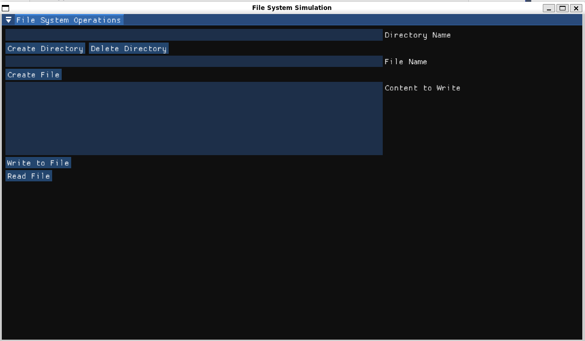
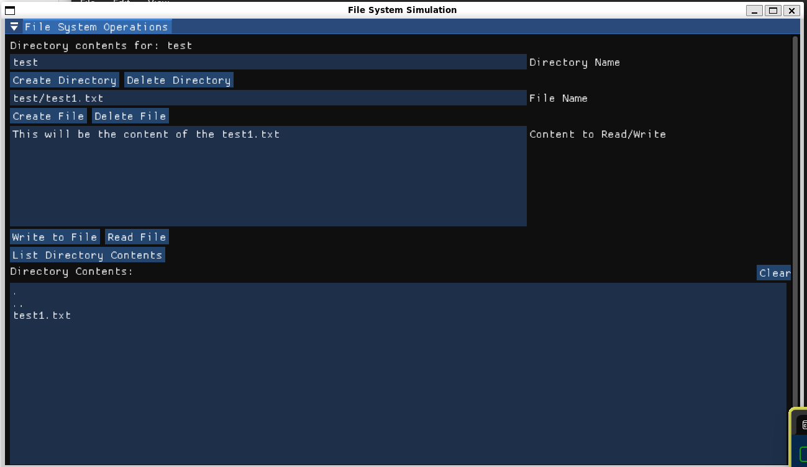

# OS-GroupProject

## File System using ImGUI

### Steps to Build and Run the program. 

1. Firstly, clone the ImGUI git repository into this project directory. We use the docking branch since it provides option to resize the windows according to our wish

    ```bash
    git clone --recursive https://github.com/ocornut/imgui -b docking
    ```

2. go to `file_system_gui` directory, and run the make command. 

    ```bash
    cd file_system_gui
    make
    ```

    > NOTE: Make sure, the make file IMGUI directory is pointed to the directory you cloned in step 1

3. Run the GUI interface:

    ```bash
    ./file_Sys_gui
    ```


### Test Screenshots:

1. GUI:



2. File Sys 2:
